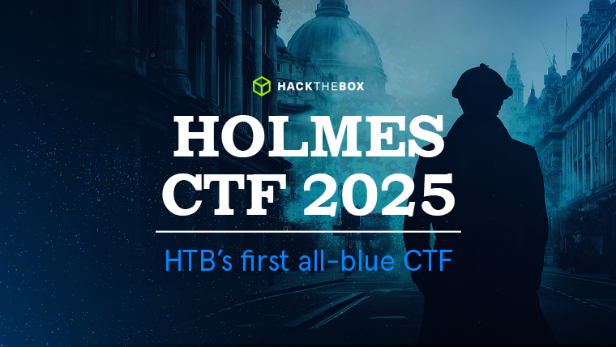

# <center>Chapter 1 - The Card</center>

-----------



-----------

<p align="center">

</p>

2025-09-10

Prepared by: achille

Sherlock Authors: achille & Joey

Difficulty: <font color="Green">Easy</font>

## Description

```
Holmes receives a breadcrumb from Dr. Nicole Vale - fragments from a string of cyber incidents across Cogwork-1. Each lead ends the same way: a digital calling card signed JM.
```

## Artifacts Provided

Enter the artifacts provided along with their file hash here.

- Chapter1_The_Card.zip - *99efc494ac61456dbe9560a24ca291a896df43b03c9abc6923984fe89060dd5b*

## Skills Learnt

* Log Analysis
* Extracting and Analyzing IOCs
* Threat Intelligence Pivoting

## Initial Analysis

----------

The analysis began by unzipping the ZIP file. Inside the archive, there were three log files: access.log, application.log, and waf.log. These are the log files from the Nicole Vale honeypot.


## Questions

----------
1. **Analyze the provided logs and identify what is the first User-Agent used by the attacker against Nicole Vale's honeypot.**

	Let's analyze the `access.log` file and find the **User-Agent** of the first request.

	
	
	**Answer:** <span style="color: #9FEF00;">`Lilnunc/4A4D - SpecterEye`</span>


2. **It appears the threat actor deployed a web shell after bypassing the WAF. What is the file name?**

	We can answer this question by analyzing both the `application.log` and the `waf.log` files. For example, the `waf.log` file shows that a web shell was deployed shortly after some errors occurred.

	
	
	**Answer:** <span style="color: #9FEF00;">`temp_4A4D.php`</span>


3. **The threat actor also managed to exfiltrate some data. What is the name of the database that was exfiltrated?**

	Also this question can be answered by analyzing both the `application.log` and the `waf.log` files. For example, the `application.log` file shows that a `.sql` file has been downloaded.

	
	
	**Answer:** <span style="color: #9FEF00;">`database_dump_4A4D.sql`</span>


4. **During the attack, a seemingly meaningless string seems to be recurring. Which one is it?**

	Upon analyzing the log files, it becomes evident almost immediately that the recurring string is `4A4D`. This string is the hexadecimal representation of "**JM**," the initials of **James Moriarty**. This is how **WATSON** implicitly tries to catch Holmes' attention.

	
	
	**Answer:** <span style="color: #9FEF00;">`4A4D`</span>


5. **OmniYard-3 (formerly Scotland Yard) has granted you access to its CTI platform. Browse to the first IP:port address and count how many campaigns appear to be linked to the honeypot attack.**

	Upon logging into the **CogWork-Intel Graph** platform, we noticed several documented campaigns, some of which appeared to be linked to the same entity: `JM`.
	
	Selecting the `JM` entity node and clicking on the `Links` tab shows that there are five related campaigns.
	
	

	**Answer:** <span style="color: #9FEF00;">`5`</span>

6. **How many tools and malware in total are linked to the previously identified campaigns?**

  We can then choose each campaign and count how many malware and tool entities are related to each of them.  

  **Answer:** <span style="color: #9FEF00;">`9`</span>


7. **It appears that the threat actor has always used the same malware in their campaigns. What is its SHA-256 hash?**

	We can select any of the malware related to a JM campaign and then select the corresponding indicator to retrieve its SHA-256 hash.

	
	
	**Answer:** <span style="color: #9FEF00;">`7477c4f5e6d7c8b9a0f1e2d3c4b5a6f7e8d9c0b1a2f3e4d5c6b7a8f9e0d17477`</span>


8. **Browse to the second IP:port address and use the CogWork Security Platform to look for the hash and locate the IP address to which the malware connects. (Credentials: nvale/CogworkBurning!)**

	Using the credentials provided by **Nicole Vale**, we can now connect to the second platform, **CogWork Security**: `nvale/CogworkBurning!`.

	**CogWork Security** is a malware sandbox, so we can search for the malware's hash to see if it has already been indexed and analyzed.
	
	
	
	Scrolling down to the `Network Communication` section, we immediately found that the malware connects to a C2 server with IP `74.77.74.77`.
	
	**Answer:** <span style="color: #9FEF00;">`74.77.74.77`</span>


9. **What is the full path of the file that the malware created to ensure its persistence on systems?**

	Clicking the `View Details` button opens a new panel with more information about the malware. Scrolling down to `Behavioral Analysis -> File Operation` reveals two files that were created, one of these files appears to be a persistence-related script.

	
	
	**Answer:** <span style="color: #9FEF00;">`/opt/lilnunc/implant/4a4d_persistence.sh`</span>


10. **Finally, browse to the third IP:port address and use the CogNet Scanner Platform to discover additional details about the TA's infrastructure. How many open ports does the server have?**

    We connect to the **CogNet Scanner** platform, paste the identified C2 IP address into the search bar, and press `Search`. The total number of ports listed under `Open Ports` is `11`.

    

    **Answer:** <span style="color: #9FEF00;">`11`</span>

11. **Which organization does the previously identified IP belong to?**

	The server used by the threat actor seems to be a compromised software belonging to a legitimate company. If we press the Details button we can see that the Organization is `SenseShield MSP`.

	
	
	**Answer:** <span style="color: #9FEF00;">`SenseShield MSP`</span>


12. **One of the exposed services displays a banner containing a cryptic message. What is it?**

	In the `Details` panel, we can select the `Services` tab to view a list of all the exposed services. Scrolling down, we find an unknown service running on port 7474 with a very unusual and cryptic banner.

	
	
	**Answer:** <span style="color: #9FEF00;">`He's a ghost I carry, not to haunt me, but to hold me together - NULLINC REVENGE`</span>

