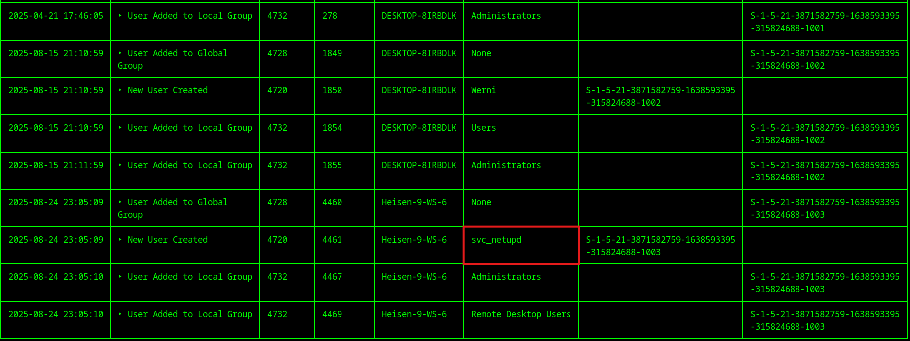
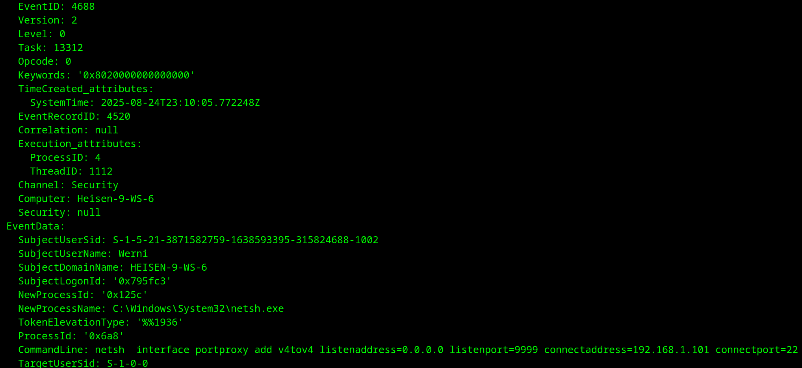

# <center>Chapter 3- The Enduring Echo</center>

-----------


-----------

2025-08-26

Prepared by: VivisGhost

Sherlock Author: VivisGhost

Difficulty: <font color="Green">Easy</font>

## Description

```
In this Sherlock players will investigate KAPE output to see the Windows management instrumentation artifacts and persistence left by a Threat actor using the machine to pivot to an internal workstation.  
```

## Scenario

```
LeStrade passes a disk image artifacts to Watson. It's one of the identified breach points, now showing abnormal CPU activity and anomalies in process logs.
```

## Artifacts Provided

- EnduringEcho.zip - *70da384a685aef13e86c6ca9375c43ac4eac64b0ad1e8f4d733df58578cb1275*  

## Skills Learnt

* Identifing WMIC usage
*  Microsoft Log Analysis
* Identifying attackers use of PortProxy

## Initial Analysis

----------

To begin the analysis, the password-protected ZIP file was unlocked using the password `hacktheblue`.

We can take a first look into the KAPE output and see its general structure. We see one user, `Werni` and the basic Windows artifacts.


One of the best ways to start getting a big picture of KAPE output is to parse the logs using a tool like **Chainsaw** and **hunt** for interesting events.


Beginning to look over the **Chainsaw** output we can see some network logons for the `Werni` user and the IP from which they are coming from. 


Further down in the **Chainsaw** output we can see a new user is created around the same time as the logins from the previous screenshot, we should take note of this for later.




## Questions

----------
1. **What was the first (non cd) command executed by the attacker on the host?**

	

	Looking through the **Chainsaw** output does not immediately yield any interesting **PowerShell** commands. With some more searching around the time of the numerous logons(Orange Box)  we can see many events with ID `4688` (Red Box). 
	
	Searching for this ID we find the **Microsoft** documentation `https://learn.microsoft.com/en-us/previous-versions/windows/it-pro/windows-10/security/threat-protection/auditing/event-4688`, which tells us this event ID signifies `A new process has been created`.
	
	In the Yellow Box we can see the command line for the process that has been created. It utilizes **cmd.exe** to run `systeminfo`. There are some other elements of the command that lend hints to which tool the attacker used, we will explore those more in the following questions.
	
	
	
	
	
	
	**Answer:** <span style="color: #9FEF00;">`systeminfo`</span>


2. **Which parent process (full path) spawned the attacker’s commands?**

	
	This answer can be seen in Blue Box from previous screenshot. The previous answer's explanation touched on the elements in the CommandLine that suggest the attacker was using an **impacket** tool. The parent process can also be helpful in determining which tool was running. This particular parent process is indicative of a specific **impacket** tool that will be identified in the next question.
	
	
	
	**Answer:** <span style="color: #9FEF00;">`C:\Windows\System32\wbem\WmiPrvSE.exe`</span>


3. **Which remote-execution tool was most likely used for the attack? (file name + extension)**

	
	The answers and explanations from the two previous questions gave us the information we needed to determine the attacker was using `wmiexec.py`. The Orange Box below shows by default the output will be grabbed from the `ADMIN$` share, this makes sense given the command lines we saw from the first question. 
	
	
	
	
	
	Now that we have an idea of what we are looking for we can use **Chainsaw** to filter for EventID 4688 and grep for the unique `cmd.exe /Q` string. This returns most of the commands the attacker ran. We can see `systeminfo` from the first question in the Red Box. The Orange, Yellow and Purple boxes show the movements and directories the attacker enumerated. This will be extremely helpful moving forward in the investigation. 
	
	
	
	
	
	
	**Answer:** <span style="color: #9FEF00;">`wmiexec.py`</span>


4. **What was the attacker’s IP address?**

	
	We can see this answer from the logons in the initial analysis. If we need more proof this is the malicious IP we will see it in questions #6 and #8.
	
	
	
	**Answer:** <span style="color: #9FEF00;">`10.129.242.110`</span>


5. **What is the first element in the attacker's sequence of persistence mechanisms?**

	

	To answer this question we first go to `C/Windows/System32/Tasks`. These tasks are a classic way attackers use to obtain persistence on a machine.
	
	
	
	Looking through the file we can see information like how often the task runs and what command the task runs. In our example we can see it executes a **PowerShell** script found in `Appdata\Local`. 
	
	
	
	
	
	**Answer:** <span style="color: #9FEF00;">`SysHelper Update`</span>


6. **Identify the script executed by the persistence mechanism. (Full path + file name + extension)**

	
	Looking below we can see the file in question `JM.ps1`.
	
	
	
	
	
	
	
	We can finally see the contents of the **PowerShell** script. The script
	
	1) Starts by initializing a list of usernames.
	2) Checks if one of the usernames already exists.
	3) If not, it creates the user with a password of `Watson_`+the time the user was created.
	4) Gives the user the ability to RDP into the machine
	5) Exfiltrates the username and password to `NapoleonsBlackPearl.htb`.
	
	
	
	
	**Answer:** <span style="color: #9FEF00;">`C:\Users\Werni\AppData\Local\JM.ps1`</span>


7. **What local account did the attacker create?**

	
	We were suspicious of this user creation in the initial analysis. After seeing the **PowerShell** script we can confidently say this user was created by the threat actor.
	
	
	
	
	
	
	
	**Answer:** <span style="color: #9FEF00;">`svc_netupd`</span>


8. **What domain name did the attacker use for credential exfiltration?**

	
	We found the domain in Question #6 and the attackers IP in Question #4. Continuing to look at the commands the attacker ran we find a command where the attacker links the domain and IP in `etc/hosts`, this is conclusive proof the suspicious domain was used for exfiltration. 
	
	
	
	
	
	**Answer:** <span style="color: #9FEF00;">`NapoleonsBlackPearl.htb`</span>


9. **What password did the attacker's script generate for the newly created user?**

	

	We can see how the password was constructed from the 3rd screenshot in question #6 (Orange and Yellow Boxes). We know that there was a web request the exfiltrated the username and password. If we can get that we just need to see the time the command was ran and we can get use that to reconstruct the password. We can look for that web request in the logs, but unfortunately it's not there. 
	
	We can also just try the time we see in the creation of the user from the logs in the initial analysis. This will not work either due to time shifts.
	
	To recover  and confirm the password the first step is to get the hash. We will need 3 hives to do this, all found in the `config` folder as seen below.
	
	
	
	
	
	To get the hash we use the `SAM`, `SECURITY` and `SYSTEM` hives with **impacket-secretsdump**. In the Red Box we can see the user and the password hash.
	
	
	
	We know the first part of the password is the string `Watson_` concatenated to the time which the command was run. We can refer to the logs which showed us when the account was created to get a general sense of the time. We use then use `20250824`(the Year,Month and Day) concatenated with `?d?d?d?d?d?`. The `?d` his tells **hashcat** to use only digits when brute force the other characters. 
	
	
	
	
	
	Looking back at the original times we see the year, month, day, minutes and seconds were the same. However there is a 7 hour difference between the 2 times. The observed 7-hour difference between the log time and the script execution time can be attributed to daylight saving time (DST). The system is set to the Pacific Time Zone (UTC-08:00), which observes DST. During DST, the time zone shifts to UTC-07:00. In this case, the script was executed during a period when DST was in effect, resulting in a 7-hour difference from the standard time. 
	
	
	
	**Answer:** <span style="color: #9FEF00;">`Watson_20250824160509`</span>


10. **What was the IP address of the internal system the attacker pivoted to?**

	
	In Question #3 we showed a query to list most of the commands the attacker ran. When the player runs that query they should notice a command to run a file called `proxy.bat`. 
	
	
	
	
	
	
	**Answer:** <span style="color: #9FEF00;">`192.168.1.101`</span>


11. **Which TCP port on the victim was forwarded to enable the pivot?**

	
	We can see this answer as the `listenport` from the previous screenshot. 
	
	
	
	**Answer:** <span style="color: #9FEF00;">`9999`</span>


12. **What is the full registry path that stores persistent IPv4→IPv4 TCP listener-to-target mappings?**

	
	The **PortProxy** configurations are saved in the registry. To view them we can use a tool like **regripper** to parse the **SYSTEM** hive. 
	
	
	
	
	
	
	
	
	
	
	
	
	
	**Answer:** <span style="color: #9FEF00;">`HKLM\SYSTEM\CurrentControlSet\Services\PortProxy\v4tov4\tcp`</span> 
	
	
	
12. **What is the MITRE ATT&CK ID associated with the previous technique used by the attacker to pivot to the internal system? (Format: Txxxx.xxx)**

	

	Visiting the MITRE ATT&CK website we can quickly find the entry for this technique (`https://attack.mitre.org/techniques/T1090/001/`). This technique allows attackers to use compromised systems as a pivot to reach other internal systems they would not otherwise have access to.
	
	
	
	
	
	
	Below we can see a table from a CISA paper `https://www.cisa.gov/sites/default/files/2024-03/aa24-038a_csa_prc_state_sponsored_actors_compromise_us_critical_infrastructure_3.pdf` outline how the threat actor**Volt Typoon** has used this exact same technique. 
	
	
	
	
	
	
	**Answer:** <span style="color: #9FEF00;">`T1090.001`</span> 
	
	
	
12. **Before the attack, the administrator configured Windows to capture command line details in the event logs. What command did they run to achieve this?** 

	
	In the same CISA paper referenced in the previous question, readers can find recommendations for combatting the techniques employed by **Volt Typhoon**. As mentioned before the group has been known to use the pivoting method from the last question, but they also have been known to use `wmic-exec` as well. 
	
	
	
	
	
	
	
	**Answer:** <span style="color: #9FEF00;">`reg add "HKLM\SOFTWARE\Microsoft\Windows\CurrentVersion\Policies\System\Audit" /v ProcessCreationIncludeCmdLine_Enabled /t REG_DWORD /d 1 /f`</span>

