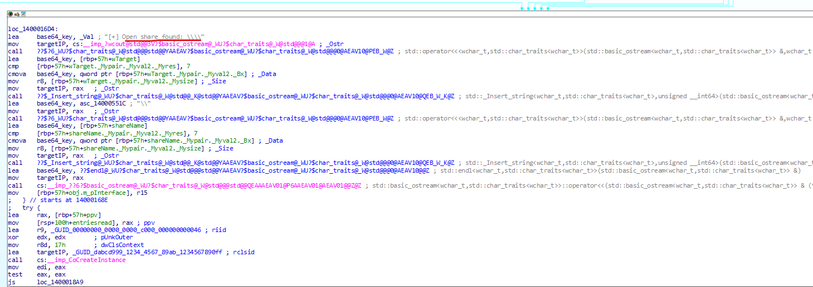

# <center>Chapter 5 - The Payload</center>

-----------


-----------

2025-04-09

Prepared by: iamr007

Sherlock Author(s): iamr007

Difficulty: <font color="Grey">Hard</font>

## Description

```
Analyze a stealthy malware sample that silently propagates across systems. Your task is to uncover its hidden logic, understand how it maintains persistence, and reveal the secret it’s designed to protect.
```

## Scenario

```
With the malware extracted, Holmes inspects its logic. The strain spreads silently across all HPCs. Its goal? Not destruction—but something more persistent…friends.
```

## Artifacts Provided

- watson.exe - *23486BB549AE3853EAB51BCBE06A4AAFB849449F2C43D2402E2A40A3F989BFA6*
- watson.pdb - *EBFF5C634B40695400F6A33FD19FDCC3111AB20368E6B275CCC8502EC0B68BC1*
- DANGER.txt - *4172B3922D3E67C7AD5F419FE23084468512BD1177E1B5F799A0D8877B1C7ECA*

## Skills Learnt

* Understanding interaction between native C++ code and COM/.NET DLLs.
* Reversing binaries that combine unmanaged and managed code.
* Understanding GUIDs, registry registration of COM objects.
* How .NET assemblies are exposed via COM interop.
* Detecting clr.dll presence for .NET runtime hosting.
* Using Windows APIs (EnumProcessModules, RegOpenKeyEx) for environment checks.

## Initial Analysis

----------

To begin the analysis, the password-protected ZIP file was unlocked using the password `hacktheblue`.

After unlocking, open the .exe file in your preferred debugger and load the symbols using the provided `.pdb` file from the artifacts.

For this writeup we will be using IDA Freeware for analysis.

## Questions

----------
1. **During execution, the malware initializes the COM library on its main thread. Based on the imported functions, which DLL is responsible for providing this functionality?**

	Upon opening the `.exe` file in IDA Pro, we can see the disassembly of the `main` function, where it is immediately apparent that the binary calls the `CoInitialize` API to initialize the COM library. Navigating to the import tab we can see that `CoInitialize` is part of `ole32.dll`.
	
	

	**Answer:** <span style="color: #9FEF00;">`ole32.dll`</span>


2. **Which GUID is used by the binary to instantiate the object containing the data and code for execution?**

	We trace the execution starting from `CoInitialize`, and after several instructions, observe the binary invoking the `CoCreateInstance` API. The disassembly reveals that this API accepts four arguments, with the first argument being associated with the code used to create the object.
	
	

	**Answer:** <span style="color: #9FEF00;">`DABCD999-1234-4567-89AB-1234567890FF`</span>
	
3. **Which .NET framework feature is the attacker using to bridge calls between a managed .NET class and an unmanaged native binary?**

	Analysing the assembly instruction just before the `CoCreateInstance` API, we see an interface called `m_pInterface`
	
	
	
	Upon double-clicking it, we discover that it points to a structure named `DNS::_Program`:
	
	
	
	Further inspecting `_Program` by double-clicking reveals that the binary is using a `vtable` for execution.
	
	
	
	Based on the above `vtable` we observe that:
		1. Methods like `get_ToString`, `Equals`, `GetHashCode`, and `GetType` are .NET `System.Object` methods that appear when a .NET object is exposed to native code.
		2. The presence of `IDispatch` and `IUnknown` methods (GetTypeInfo, Invoke, GetIDsOfNames, etc.) indicates usage of COM interoperability.
		3. The `DNS::_Program` naming and the fact that methods accept/return `wchar_t*` for strings is also consistent with managed code marshaled to native.
		4. The `vtable` layout is common when a .NET class is compiled to an assembly, registered for COM, and accessed from native code
		
	So yes — this strongly suggests it’s a `.NET assembly` that’s being consumed through COM. To identify this functionality, we can simply search for `IUnknown IDispatch ToString GetType vtable` on Google, which leads us to Microsoft’s documentation on the `COM Callable Wrapper` — a component of the `COM Interop` feature.
	
	

	**Answer:** <span style="color: #9FEF00;">`COM Interop`</span>

4. **Which Opcode in the disassembly is responsible for calling the first function from the managed code?<br> (Answer Placeholder: \** \** \**)**

	In the `vtable`, methods such as `get_ToString`, `Equals`, `GetHashCode`, and `GetType` correspond to .NET `System.Object` methods. However, three notable methods — `SendEncryptedFlag`, `Execute` and `Dummy` — stand out, accessible at offsets `0x58`, `0x60` and `0x68` within the `vtable`.
	
	
	
	Returning to the `main` function and following the execution flow after `CoCreateInstance`, we observe that `Dummy` is the first method invoked from managed code, executed via the instruction `call qword ptr [rax+68h]`.
	
	

	**Answer:** <span style="color: #9FEF00;">`FF 50 68`</span>
	
5. **Identify the multiplication and addition constants used by the binary’s key generation algorithm for decryption.<br> (Answer Placeholder: \*, \**h)**

	In the disassembly, we find a `printf` statement containing the string `Base64 Key for XOR` just before the instruction:
	`mov [rsp+278h+decryptedResult], rdi`. 
	
	
	
	Tracing back, we observe that immediately after executing the function `IsClrLoaded`, there is a function performing a mathematical operation — multiplying by the constant `7` and adding `42h`. Upon completing this operation, the function calls another routine to Base64 encode the bytes. This sequence confirms that the previously identified function performing the mathematical operation is responsible for generating the XOR key.
	
	
	
	

	**Answer:** <span style="color: #9FEF00;">`7, 42h`</span>


6. **Which Opcode in the disassembly is responsible for calling the decryption logic from the managed code?<br> (Answer Placeholder: \** \** \**)**

	After the generation of XOR key, the binary executes another instruction from `m_pInterface`:
	
	
	
	From analyzing the logic after above instruction, we observe that the encrypted an Base64 encoded string `KXgmYHMADxsV8uHiuPPB3w==` being assigned to a variable and then calling the `SendEncryptedFlag` function from the manage code with instruction:
	`call qword ptr [rax+58h]`
	
	
	
	**Answer:** <span style="color: #9FEF00;">`FF 50 58`</span>

7. **Which Win32 API is being utilized by the binary to resolve the killswitch domain name?**

	All the Win32 API functions used by the binary can be found in the `imports` tab. Upon checking, we see that several Win32 APIs are linked to `WS2_32`.
	
	
	
	`getaddrinfo` appears to be one of the more interesting entries in the list, and double-clicking on `getaddrinfo` and `main+5BC↑p` reveals the following set of instructions:
	
	
	
	Analyzing the preceding instruction set, we observe that the decrypted result of base64 encoded string `KXgmYHMADxsV8uHiuPPB3w==` is passed to the `getaddrinfo` API through the `rbx` register for domain resolution.
	
	
	

	**Answer:** <span style="color: #9FEF00;">`getaddrinfo`</span>
	
8. **Which network-related API does the binary use to gather details about each shared resource on a server?**

	We then navigate back to the `imports` tab, where we find two interesting functions being used from the `NETAPI32` library.
	
	
	
	Double-clicking on `NetShareEnum` reveals that it is being used within another function named `ScanAndSpread`:
	
	
	
	Within the `ScanAndSpread` function, we see that the `NetShareEnum` API is used to enumerate open shares on the specified target IP address:
	
	
	
	

	**Answer:** <span style="color: #9FEF00;">`NetShareEnum`</span>


9. **Which Opcode is responsible for running the encrypted payload?<br> (Answer Placeholder: \** \** \**)**

	After detecting an open share on one of the IP addresses, we can see in the same subroutine `loc_1400016D4` that the binary once again calls the `CoCreateInstance` API to load the code associated with the previously identified GUID `DABCD999-1234-4567-89AB-1234567890FF`:
	
	
	
	Following the instruction set after the execution of `OleRun`, we reach a point where an encrypted Base64 payload is passed as an argument to a function at offset `60h` through the instruction `call qword ptr [rax+60h]`.
	
	
	
	Returning to the `vtable`, we observe that the offset `60h` corresponds to the `Execute` method in the managed code, confirming that the above `call` instruction is responsible for executing the encrypted payload:
	
	
	
	**Answer:** <span style="color: #9FEF00;">`FF 50 60`</span>


10. **Find → Block → Flag: Identify the killswitch domain, spawn the Docker to block it, and claim the flag.**

	So far, binary analysis has not revealed any hardcoded encryption/decryption keys, but we know a key is being generated through a mathematical operation after checking if the CLR is loaded or not from the `IsClrLoaded()` function. We have also identified the exposed .NET methods inside the `vtable` in following order, `SendEncryptedFlag`, `Execute` and `Dummy`, associated with the GUID `DABCD999-1234-4567-89AB-1234567890FF`. In the vtable, `DNS` corresponds to the namespace, and `_Program` represents the managed `Program` class exposed via COM. Based on this information, below is the .NET DLL with COM visibility:
	
	```
	using System;
	using System.Runtime.InteropServices;
	using System.Text;
	using System.Data;
	
	namespace DNS
	{
		[ComVisible(true)]
		[Guid("DABCD999-1234-4567-89AB-1234567890FF")]
		[ClassInterface(ClassInterfaceType.AutoDual)]
		public class Program
		{
			// Decrypts XOR-encrypted bytes
			public string SendEncryptedFlag(string base64Encrypted, string base64Key)
			{
				try
				{
					byte[] encryptedBytes = Convert.FromBase64String(base64Encrypted);
					byte[] keyBytes = Convert.FromBase64String(base64Key);
					byte[] decrypted = new byte[encryptedBytes.Length];
	
					for (int i = 0; i < encryptedBytes.Length; i++)
					{
						decrypted[i] = (byte)(encryptedBytes[i] ^ keyBytes[i % keyBytes.Length]);
					}
	
					return Encoding.UTF8.GetString(decrypted);
				}
				catch (Exception ex)
				{
					return "[Decryption error: {ex.Message}]";
				}
			}
	
			public void Execute(string targetIP, string base64Encrypted, string base64Key)
			{
				Console.WriteLine("This is execute");
			}
	
			public string Dummy()
			{
				return "This is .NET";
			}
		}
	}
	```
	
	To register the compiled .NET DLL, run the command `regasm.exe /codebase <YOUR DLL NAME>` as an administrator from the `C:\Windows\Microsoft.NET\Framework64\<YOUR VERSION>` directory:
	
	
	
	After registration, executing the `.exe` reveals the decrypted domain name `k1v7-echosim.net`, which also serves as the killswitch domain. 
	
	

	This domain can be entered into the DNS Sinkhole application accessible by spawning the challenge's docker container.
	
	Once this has been successfully entered you will receive your flag.
	
	
	
	**Answer:** <span style="color: #9FEF00;">`HTB{Eternal_Companions_Reunited_Again}`</span>