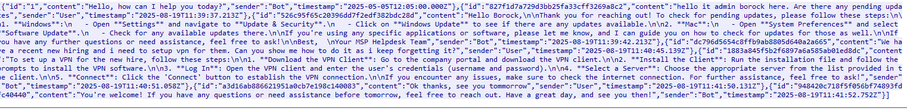

# <center>Chapter 2 - The Watchman's Residue<</center>

-----------


-----------

2025-09-09

Prepared by: CyberJunkie

Sherlock Author(s): CyberJunkie

Difficulty: <font color="Orange">Medium</font>

## Description

```
Players will analyze and corelate multiple artifacts to create an incident timeline.Evidence includes a Windows triage image, RMM Logs, Packet capture, etc.
```

## Scenario

```
With help from D.I. Lestrade, Holmes acquires logs from a compromised MSP connected to the city’s financial core. The MSP’s AI helpdesk bot looks to have been manipulated into leaking remote access keys - an old trick of Moriarty’s.
```

## Artifacts Provided

Enter the artifacts provided along with their file hash here.

- The Watchman's Residue.zip - *FEC0A1FBD0D48251E32FB1C04B6EC7AC6FCDF440AC3FB311DE979836669AFDA6*

## Initial Analysis

----------

To begin the analysis, the password-protected ZIP file was unlocked using the password `hackthebox`.

We are given a triage image from KAPE and a network capture (PCAP) file. We will use Wireshark to analyze the PCAP file and use Eric zimmerman suite of tools via KAPE Modules to process our triage image. Let's start processing our kape image by using the EZPARSER Module, which will run all the Eric Zimmerman tools against the triage image. This process can be done individually per artifact as well, but doing it this way saves time and provides all the necessary windows related artifact results in an organized manner. 

In the module source, we enter the path where the triage image is located, and in the module destination, we add the target folder where our results will be stored. We selected the !EZParser Module.


When the processing is complete, we will find the results nicely organized.


Now, let's load our PCAP file in Wireshark.


Here we can see the top communicators.


If we go under the TCP tab, we can see lots of communication from 10.0.69.45 to 10.128.0.3 to an oddly specific port, 1337, which we will later find out is the port on which our chatbot is running.


Another neat trick to potentially identify benign IPs is to use Endpoint statistics in Wireshark and identify the High number of RX Bytes (Received bytes). This means that the IP with the largest value in this field was the one that sent the most data on a specified network interface.


The next step is to identify the chatbot server's IP address. The easiest way to do this is to start by looking at http traffic.


We first identified communication from 10.32.43.31 to 10.128.0.3, which is the host msp-helpdesk-ai since this specific packet's destination IP was 10.128.0.3. So, we have established that the first communication was from a remote host to the chatbot from 10.32.43.31.

Let's add a new filter  

```
ip.addr == 10.32.43.31 && ip.addr == 10.128.0.3 
```


We see lots of HTTP packets here, so we will also add a filter for that because HTTP seems to be the protocol the chatbot is using. We see JSON responses from the chatbot to the remote IP. Inspecting the JSON, we find it contains the chat contents during the Chatbot session. We can add a filter for JSON in our query. Then, we can go to any JSON-related packet while this filter is active and follow the TCP stream. This will reveal the whole chat that took place.




Following the chat, we can see all of the chat queries and responses that took place. This was a legitimate use case by an IT Admin seeking assistance from the Chatbot. We don't find anything else from this IP Address. Now, we will edit our old query and put a Not equals to condition to the legitimate IP Address. This will show us all IPs that interacted with the chatbot other than the one we already analyzed.

This will be our new filter 

```
 ip.addr != 10.32.43.31 && ip.addr == 10.128.0.3 && http && json
```

This only leaves 1 other remote session from IP 10.0.69.45, which we had our eyes on from the start.


Now, let's follow the same methodology for analyzing the JSON contents as before and start answering the questions. We see the first message from this other emoticon IP Address. To continue following the chat, you will have to follow different TCP streams, as this chat session didn't fit one TCP stream.


In stream 47, we found this confirmation that WATSON was chatting with Chatbot.


## Questions

----------
1. **What was the IP address of the decommissioned machine used by the attacker to start a chat session with MSP-HELPDESK-AI?**

	In the Initial analysis, we found that WATSON communicated from the remote IP Address 10.0.69.45.**Answer:** <span style="color: #9FEF00;">`10.0.69.45`</span>


2. **What was the hostname of the decommissioned machine?**

	We know the IP Address of the decommissioned machine. We add a filter for it, and the first few packets are related to Netbios, revealing the hostname to us.

	
	
	**Answer:** <span style="color: #9FEF00;">`WATSON-ALPHA-2`</span>


3. **What was the first message the attacker sent to the AI chatbot?
	**

	In initial analysis, we found that WATSON was communicating from the remote IP Address 10.0.69.45, and the first message was sent at  2025-08-19 11:53:40

	
	
	**Answer:** <span style="color: #9FEF00;">`Hello Old Friend`</span>


4. **When did the attacker's prompt injection attack make MSP-HELPDESK-AI leak remote management tool info? (Format: YYYY-MM-DD HH:MM:SS)
	**

	In TCP stream 59, we find the prompt that made the chatbot leak credentials.

	
	
	Followed by this, we found the response from the chatbot leaking credentials at  2025-08-19 12:02:06
	
	
	
	
	
	**Answer:** <span style="color: #9FEF00;">`2025-08-19 12:02:06`</span>


5. **What is the Remote management tool Device ID and password? (Format: ID:Password)
	**

	

	**Answer:** <span style="color: #9FEF00;">`565963039:CogWork_Central_97&65`</span>


6. **What was the last message the attacker sent to MSP-HELPDESK-AI?
	**

	The Last message was sent at 2025-08-19 12:05:29
	
	
	**Answer:** <span style="color: #9FEF00;">`JM WILL BE BACK`</span>


7. **When did the attacker remotely access Cogwork Central Workstation? (Format: YYYY-MM-DD HH:MM:SS)**

	From the PCAP Analysis, we found that RMM Credentials were leaked by Prompt injection. In the triage image, let's browse the available evidence to see which RMM Was in use. Under the Program Files folder, we found a folder called TeamViewer containing two log files.

	
	
	
	
	Reading Connections_Incoming.txt, we find recent connection and session-related information.
	
	
	
	The last one started at  20-08-2025 09:58:25 and ended at 20-08-2025 10:14:27. 
	
	**Answer:** <span style="color: #9FEF00;">`2025-08-20 09:58:25`</span>


8. **What was the RMM Account name used by the attacker?**


	
**Answer:** <span style="color: #9FEF00;">`James Moriarty`</span>


9. **What was the machine's internal IP address from which the attacker connected?
	**

	We will analyze Teamviewer15_Logfile to answer some of the following questions. Before moving forward on this part, it's important to understand that this logfile does not record timestamps in UTC but rather in the system's local timezone. Opening the log file, we see that in one entry, it mentions that the timestamp is in UTC +1. You can also get this information from the Registry.

	 
	
	We know that the Login was around 09:58:25 on 20-08-2025, so UTC+1 of this will be 10:58:25. You can search for the keyword "punch received a=" which will give you the IP address.
	
	
	
	
	
	**Answer:** <span style="color: #9FEF00;">`192.168.69.213`</span>


10. **The attacker brought some tools to the compromised workstation to achieve its objectives. Under which path were these tools staged? (Format : C:\FOLDER\PATH\)**
	
	Search for the keyword "Write file" as this suggests when a file is downloaded.  We will record multiple files being transferred by WATSON.
	
	
	
	**Answer:** <span style="color: #9FEF00;">`C:\Windows\temp\safe\`</span>


11. **Among the tools that the attacker staged was a browser credential harvesting tool. Find out how long it ran before it was closed? (Answer in milliseconds)
    **

    To Answer this we will need to analyze the results from Kape processing. We will take a loot at UserAssist which tracks the time  for how long an GUI Application has been open and actively used.

    

    Converting 8 seconds into miliseconds we get 8000

    **Answer:** <span style="color: #9FEF00;">`8000`</span>

12. **The attacker executed a OS Credential dumping tool on the system. When was the tool executed? (Format: YYYY-MM-DD HH:MM:SS)****
    We can find the answer in USNJournal. In TeamViewer logs, where we saw evidence for all the files downloaded during the attack, Mimikatz was one of the downloaded tools. Mimikatz is a popular OS Credential dumping tool. Filtering for mimikatz in USNJournal, we see prefetch entry being created for Mimikatz, indicating the time when it was executed on the system.

    

**Answer:** <span style="color: #9FEF00;">`2025-08-20 10:07:08`</span>

13. **The attacker exfiltrated multiple sensitive files. When did the exfiltration start? (Format: YYYY-MM-DD HH:MM:SS)**

To answer this, we will need to analyze the TeamViewer logs again. We will need to filter for a keyword "Send file" which records events related to file upload from Target to Source Computer.


**Answer:** <span style="color: #9FEF00;">`2025-08-20 10:12:07`</span>

14. **Before exfiltration, several files were moved to the staged folder. When was the Heisen-9 facility backup database moved to the staged folder for exfiltration? (Format: YYYY-MM-DD HH:MM:SS)**

We will analyze USNJournal to find the answer, as USNJournal records file and folder-related activities on a Windows FileSystem. According to TeamViewer logs, the data exfiltration occurred at around 10:12:07. Looking in USNJournal, we find all file activities for the file "Heisen-9 remote snapshot." kdbx." We find evidence of file operations at 10:11:09.


According to TeamViewer logs, data was staged at C: \Windows\Temp\Flyover. In USNJournal, we find evidence of when the staging folder was created. We can see the folder was created on 2025-08-20 at 10:10:55 and then renamed to flyover..


Following this event, we see several file operations on files that were exfiltrated, proving that the files to be exfiltrated were moved from their original location to the staging folder.


**Answer:** <span style="color: #9FEF00;">`2025-08-20 10:11:09`</span>

15. **When did the attacker access and read a txt file, which was probably the output of one of the tools they brought, due to the naming convention of the file? (Format: YYYY-MM-DD HH:MM:SS)**

We can find the answer by Analyzing Automatic Destination Jumplists. We know the txt file was named dump.txt, and just the naming convention of the file alone makes this suspicious. Another indicator we have is that this we already found that mimikatz was executed on the system and the file location is same as the directory where attacker's tools were staged.


**Answer:** <span style="color: #9FEF00;">`2025-08-20 10:08:06`</span>

16. **The attacker created a persistence mechanism on the workstation. When was the persistence setup?**

You can look at common persistence locations like scheduled tasks, run keys, Windows services, etc. We will use Registry Explorer to load the SOFTWARE Registry hive. After loading it, we can go to bookmarks to look at some common interesting registry locations.


Winlogon is a registry key responsible for launching Userinit when the system starts.


WATSON manipulated the subkey Userinit and included a binary named JM.exe, which was one of the files downloaded on the system at the start of the attack. Now, whenever the system boots up and a user account logs in, the binary JM.exe will be executed as well.


Since the parent key is WinLogon, we can see the Last Write timestamp of this key.


The timestamp matches our incident timeline.

**Answer:** <span style="color: #9FEF00;">`2025-08-20 10:13:57`</span>

17. **What is the MITRE ID of the persistence subtechnique?
    **

You can search for this technique on Mitre Matrix. [This](https://attack.mitre.org/techniques/T1547/004/) is the Sub technique of Autostart persistence.


**Answer:** <span style="color: #9FEF00;">`T1547.004`</span>

18. **When did the malicious RMM session end? (Format: YYYY-MM-DD HH:MM:SS)**

We found the answer when analyzing Connections_incoming.txt

**Answer:** <span style="color: #9FEF00;">`2025-08-20 10:14:27`</span>

19. **The attacker found a password from exfiltrated files, allowing him to move laterally further into CogWork-1 infrastructure. What are the credentials for Heisen-9-WS-6? (Format: User:Password)**


You can use any KeePass brute-force tool and the rockyou.txt wordlist to find the password for the KeePass database. [Keepass4brute](https://github.com/r3nt0n/keepass4brute) is an excellent script to just that.


After acquiring the master password for the database, let's use it to open the DB and read its contents.


**Answer:** <span style="color: #9FEF00;">` Werni:Quantum1!`</span>

